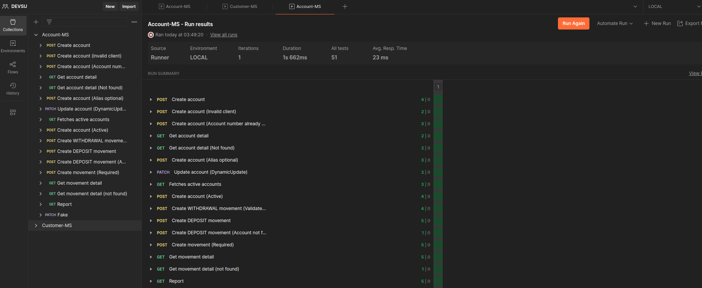
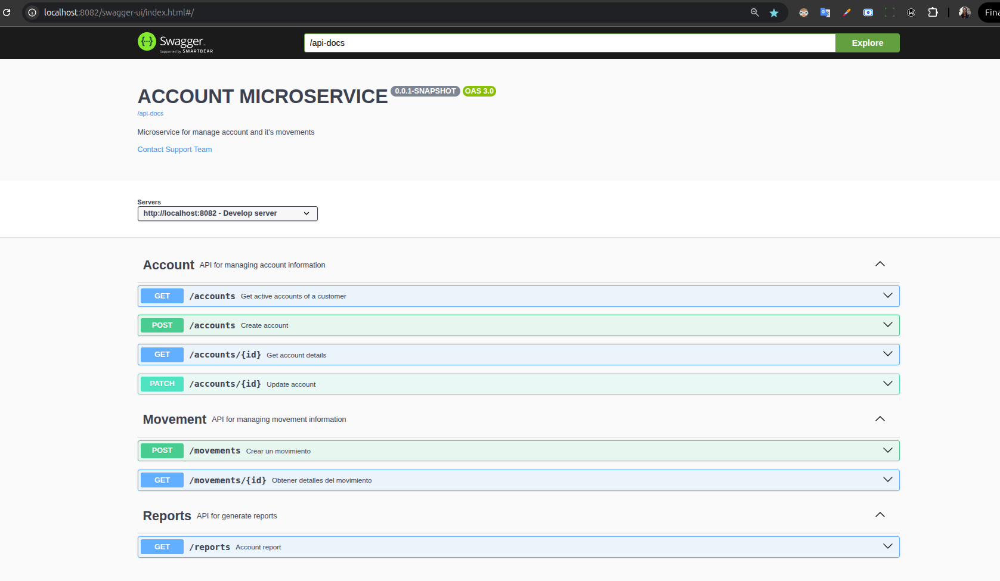

# account-microservice
Microservicio que gestiona la información de las cuentas y sus movimientos, consume eventos async para crear/actualizar/eliminar clientes.
Esta API cuenta con un CRUD `/accounts` y `movements`, y algunos endpoints adicionales como `reporte de cuentas por cliente con sus movimientos filtrados por rango de fecha.
La API fue desarrollada con Java y Spring Boot, y Postgres como Gestor de base de datos, siguiendo una arquitectura hexagonal y DDD.
Se implementaron pruebas con Postman y algunas pruebas unitarias.

### Levantar los microservicios
- El proceso de levantar en local un **rabbitmq** y el microservicios de clientes, está descrito en el microservicio de customers en su `README.md`
- Posteriormente se debe levantar el microservicio de account-service
- O se puede con docker levantar toda la infraestructura desde el proyecto/carpeta `infra`
  Esta variante se encuentra detallada en `infra/README.md`

### Set-up desde el IDE
2. Instalar postgres y crear la base de datos `db_accounts_test`

3. Levantar el MS. Esto ejecutará en automático las migraciones de DB con las tablas y datos iniciales.

    Clonar desde:
   [git@github.com:grleyvaj/account-microservice.git](git@github.com:grleyvaj/account-microservice.git)

4. Probar desde Posmtan o Swagger que se documentan en la siguiente sección

## Suite de pruebas con postman
Se implementaron pruebas con JS en postman

Esta documentación la puede ejecutar importando los archivos que se encuentran en la carpeta de `/documentation`

Colección:
[Account-MS.postman_collection.json](docuementation/Account-MS.postman_collection.json)
Variables de entorno LOCAL para postman:[LOCAL.postman_environment.json](docuementation/LOCAL.postman_environment.json)

## Documentación de la API
Al levantar la aplicación, puede visualizar la documentación en: http://localhost:8082/swagger-ui/index.html#/

La API fue documentada en EN y en ES, lo cual puede configurar con la variable de entorno `OPENAPI_LANGUAGE`
- Inglés(por defecto): `i18n/swagger_messages.properties`
- Español: `i18n/swagger_messages.properties_es`

La api first está adjunta en la carpeta `/documentation`: [open-api.yml](docuementation/open-api.yml)

### Comando útiles de docker para rabbit (opcional: solo si se requiere limpiar)
Detener rabbit:
```bash
    docker stop rabbitmq
```
Eliminar rabbit:
```bash
    docker rm rabbitmq
```
